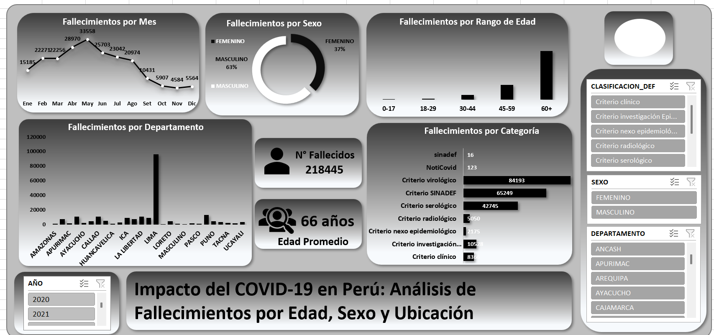

# COVID-19 Deaths Analysis in Peru (Excel Dashboard)

This project analyzes **COVID-19 deaths in Peru** using **Microsoft Excel**, focusing on trends by **age group, sex, department, and time period**.  
The main deliverable is an **interactive dashboard** built with pivot tables, slicers, and KPI indicators.

---

## Project Objective
To explore and visualize patterns of COVID-19 mortality in Peru, identifying key demographic groups and temporal trends through an Excel dashboard.

---

## Tools Used
- Microsoft Excel
- Data Cleaning (Excel)
- Pivot Tables
- Pivot Charts
- Slicers (Interactive Filters)
- KPI Metrics and Dashboard Design

---

## Dataset
The dataset contains records of COVID-19 related deaths in Peru, including:

- Age
- Sex
- Department
- Date of death
- Age group (categorized)
- Year / Month
  
---

## Key Dashboard Metrics
- Total deaths
- Average age of death
- Deaths by sex
- Deaths by age group
- Deaths by department
- Deaths by month and year

---

## Dashboard Preview

---

## Key Insights (Example Findings)
- The highest number of deaths occurred in older age groups (60+).
- Male deaths represent a higher percentage compared to female deaths.
- Certain departments show significantly higher mortality rates.
- Death trends vary strongly by month, showing clear peak periods.

